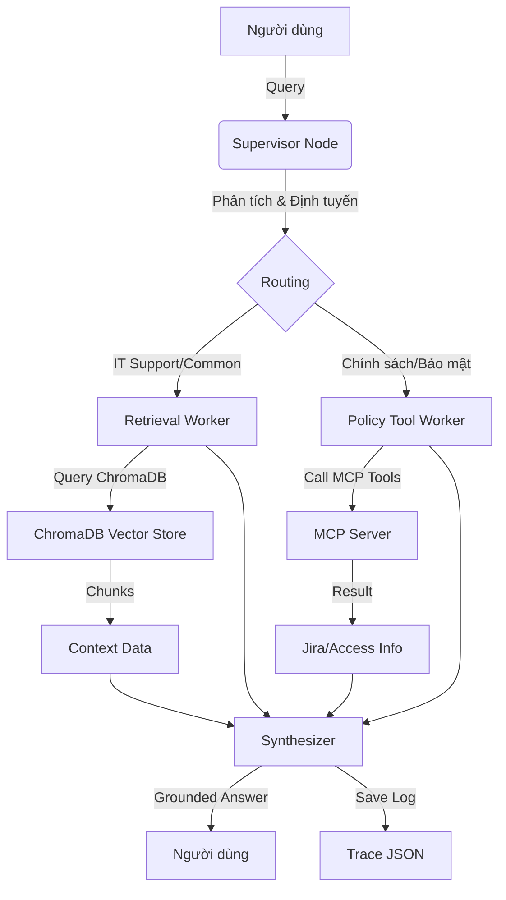

# 🏗️ Day 09: Tài Liệu Giải Thuật và Workflow Hệ Thống (Multi-Agent RAG)

Cẩm nang này mô tả chi tiết cách hệ thống Multi-Agent Supervisor-Worker vận hành để xử lý các yêu cầu phức tạp về hỗ trợ kỹ thuật và chính sách nội bộ.

---

## 🗺️ 1. Sơ Đồ Tổng Quan (System Architecture)

Hệ thống sử dụng mô hình **Supervisor-Worker**, nơi một "Agent Giám Sát" đóng vai trò điều phối các "Agent Chuyên Gia".

---

## 🧠 2. Luồng Xử Lý Chi Tiết (Step-by-Step Workflow)

### Bước 1: Tiếp nhận và Phân tích (Supervisor)
Khi có câu hỏi, Supervisor sẽ phân tích nội dung dựa trên 3 tiêu chí:
- **Risk Detection**: Nếu câu hỏi chứa từ khóa nguy hiểm hoặc khẩn cấp (P1, Emergency), nó sẽ bật cờ `risk_high`.
- **Worker Selection**: 
  - Nếu liên quan đến chính sách hoàn tiền, cấp quyền: Chuyển cho `policy_tool_worker`.
  - Nếu là câu hỏi kiến thức chung (SLA, Remote, FAQ): Chuyển cho `retrieval_worker`.
- **Reasoning**: Supervisor ghi lại lý do tại sao chọn agent đó để phục vụ việc debug.

### Bước 2: Thực thi Chuyên môn (Workers)

#### A. Retrieval Worker (Chuyên gia tìm kiếm)
- Sử dụng **Dense Retrieval** (OpenAI Embeddings) để tìm các đoạn văn bản (chunks) liên quan nhất trong ChromaDB.
- Chỉ tập trung vào việc cung cấp dữ liệu văn bản thô từ các file SOP.

#### B. Policy Tool Worker (Chuyên gia thực thi & MCP)
- Đây là Agent "hành động". Ngoài việc đọc tài liệu, nó còn có khả năng gọi các **MCP Tools**:
  - `get_ticket_info`: Tra cứu trạng thái thật của Ticket trên Jira.
  - `check_access_permission`: Kiểm tra xem người dùng có đủ điều kiện cấp quyền không.
- Nếu Agent thấy thông tin trong tài liệu chưa đủ, nó sẽ tự động kích hoạt các công cụ này để lấy "dữ liệu sống".

### Bước 3: Tổng hợp và Dẫn nguồn (Synthesis)
Agent tổng hợp nhận tất cả dữ liệu từ các bước trước:
- Các đoạn văn bản từ ChromaDB.
- Trạng thái ticket từ MCP.
- Kết quả kiểm tra chính sách.
- **Lưu ý**: Agent này được lập trình để **không tự bịa ra thông tin**. Nếu MCP Tools báo "Ticket không tồn tại", nó sẽ trả lời đúng như vậy thay vì giả định.

---

## 🔌 3. Tích Hợp MCP (Model Context Protocol)

MCP đóng vai trò là "cánh tay" của hệ thống, cho phép Agent kết nối với thế giới bên ngoài:

| Công cụ (Tool) | Chức năng | Dữ liệu trả về |
| :--- | :--- | :--- |
| `search_kb` | Tìm kiếm sâu trong Knowledge Base | Danh sách chunks & điểm số tương đồng. |
| `get_ticket_info` | Truy cập database Jira (Mock) | Status, Assignee, SLA deadline của Ticket. |
| `check_access_permission` | Kiểm tra quy tắc bảo mật | `can_grant` (True/False) & Danh sách người phê duyệt. |

---

## 📈 4. Giám Sát và Đánh Giá (Tracing)

Mỗi lượt chạy hệ thống sẽ tạo ra một **Trace (Vết)** dạng JSON, lưu trữ:
1. **Input**: Câu hỏi gốc.
2. **Path**: Con đường Agent đã đi (Supervisor -> Worker A -> Worker B).
3. **Evidence**: Toàn bộ dữ liệu mà các Worker đã thu thập được.
4. **Confidence**: LLM tự đánh giá độ tin cậy của câu trả lời trên thang điểm 1.0.

> [!IMPORTANT]
> **Lợi ích của Multi-Agent**: 
> Khác với cách làm cũ (Single Agent), hệ thống này có tính **Module hóa**. Bạn có thể nâng cấp công cụ MCP hoặc thay đổi chính sách của Policy Worker mà không cần phải cài đặt lại toàn bộ hệ thống RAG.
